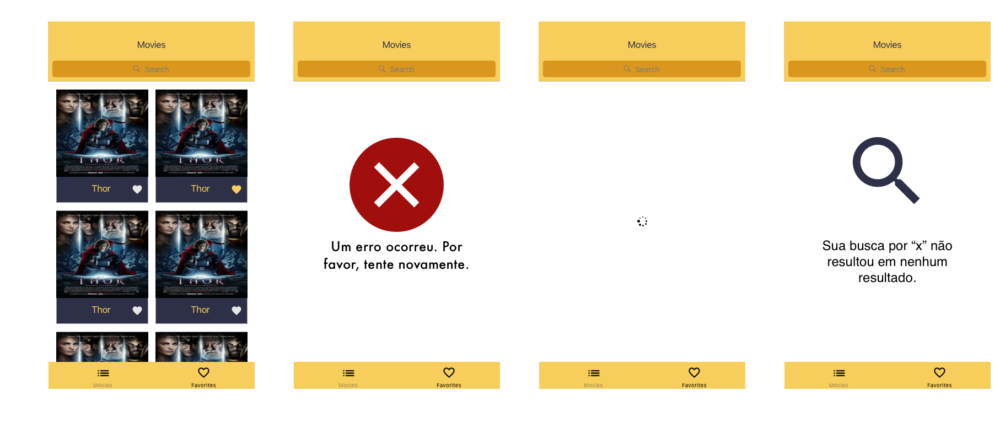

# Concrete iOS Recruit Challenge

---

## Bienvenido/a

---

¡Gracias por participar en el desafío iOS de Concrete! Estamos muy contentos por su primer paso para formar parte de un equipo excepcional.

## Al final ¿qué es ese desafío?

Tú debes crear una aplicación sobre las películas, usando la [API](https://developers.themoviedb.org/3/getting-started/introduction) de [TheMovieDB](https://www.themoviedb.org/?language=en). ¿Genial verdad? 

Para tener un estándar y un layout mínimamente definido adjuntamos algunos assets que te van a ayudar a desarrollar esa aplicación:

- [Iconos de la aplicación](assets/appIcons)
- [Screenshots](assets/screenshots)
- [Iconos](assets/icons)

Piensa en el desafío como una oportunidad de mostrar todo tu conocimiento. **¡Y hazlo con calma!** porque tienes una semana para entregar.

Dentro de los elemenos que vamos a evaluar se encuentra:

- Consumo de APIs
- Persistencia de datos (Favoritos)
- Lógicas de filtros y búsquedas.
- Estructuración de layout y flujo de aplicación.

El único requisito previo es que el código se haga en Swift, preferiblemente en la versión más actual. Eres libre de:

- Utilizar o no usar bibliotecas externas con el gestor de dependencias de tu preferencia (Cocoapods, Carthage, Swift Package Manager)
- Crear o estructurar su layout con storyboards, xibs o ViewCode
- Adoptar la arquitectura que desees.

Estamos especialmente preocupados por la calidad y creemos bastante en pruebas automatizadas. Sin embargo, sabemos que no es un tópico dominado por todos, por eso aceptamos desafíos con todos los perfiles y todo tipo de conocimiento técnico.
Sin embargo, para las posiciones *Seniors* damos mucha más importancia a la calidad del código.

# Características de la aplicación

## Debe tener:

- [ ] Pantalla de Splash
- [ ] Layout en pestañas:
  - [ ] En la primera pestaña debes mostrarse una pantalla con una grilla de películas populares. Para ello debes usar esta [API](https://developers.themoviedb.org/3/movies/get-popular-movies)
  - [ ] En la segunda pestaña debes mostrar una pantalla con una lista de películas favoritas que fueron seleccionadas en la aplicación.
- [ ] Tratamiento de errores y presentación de flujos de excepción:
  - [ ] Búsqueda vacía
  - [ ] Error generico
  - [ ] Cargando
- [ ] Al hacer clic en una película de la grilla debe dirigirse a la pantalla de detalle de la película
- [ ] La pantalla de Detalle de la película debe contener:
  - [ ] La acción para poner como favorita una película
  - [ ] El nombre del género de la película y no su ID (ej: Action, Horror, etc). Para ello, debes utilizar esta [API](https://developers.themoviedb.org/3/genres/get-movie-list).
- [ ] La pantalla de lista de favoritos debe ser persistente, es decir, debe guardarse entre sesiones de la aplicación.
- [ ] La pantalla de favoritos debe permitir borrar una película que anteriormente se guardó como favorita.

## Ganas más puntos si tienes:

### Pruebas

- [ ] Pruebas unitarias en el proyecto.
- [ ] Pruebas de UI.
- [ ] Integración contínua (Puedes usar [Bitrise](https://www.bitrise.io/), [AppCenter](https://appcenter.ms) o la plataforma de tu preferencia)

### Interacción

- [ ] Pantalla de grilla con búsqueda local (filtrar por algún término)
- [ ] Scroll infinito para hacer paginación de la API de películas populares
- [ ] Que la celda en la grilla de películas populares tenga la información si una película es favorita o no.
- [ ] Pantalla de filtro con selección de fecha de lanzamiento y género. 
  - [ ] La pantalla de filtro sólo debe ser accesible desde la pantalla de favoritos.
  - [ ] Al aplicar el filtro, debes volver a la pantalla de favoritos y hacer un filtro local usando la información seleccionada referente a la fecha de lanzamiento y el género.

# Ejemplos y sugerencias

A continuación podemos ver algunas pantallas de ejemplo de algunos de estos flujos. Son sólo sugerencias, pero puedes modificar a tu gusto.
Para facilitar el proceso, hay assets, iconos de aplicación y paleta de colores en el repositorio. Pero si su lado diseñador habla más alto ¡puedes sorprendernos!

## Flujo de grilla de películas

## Flujo con Splash, Pantalla de Detalles y pantalla de lista de favoritos

## Flujo opcional de filtro

# Proceso de desarrollo y envío

1. Haz un un fork de este repositorio. **No lo clones directamente ni intentes hacer push a este repositorio**.
2. Desarrolla tu proyecto en tu fork. Eres libre de crear/modificar/borrar las ramas que desees.
3. Al momento de hacer commit, sube los cambios a tu fork;
4. Por la interfaz de Github, haz un pull request a este repositorio.

Si tienes alguna consulta, no dudes en preguntarnos :)
